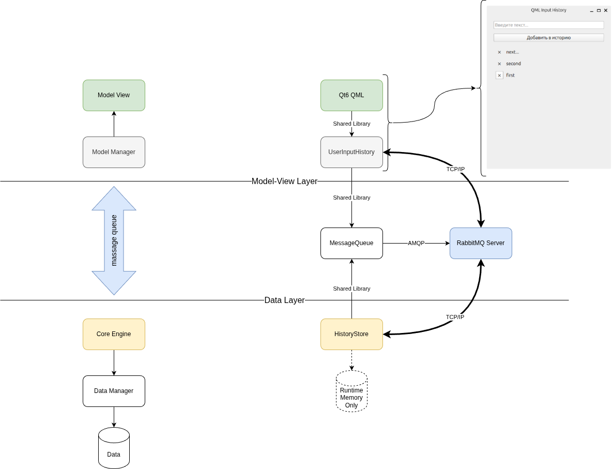

# QtPT

**Демонстрационный проект графического С++ приложения на базе Qt6-QML и RabbitMQ технологий.**

## Описание проекта и архитектурная схема
QtPT - это простое графическое клиент-серверное приложение, предназначенное для ввода текста, его передачи на сервер и сохранения.



## Детали
1. Особенности архитектуры:
   * microservice-подобная архитектура по технологии "клиент-сервер" со связью через RabbitMQ
   * графическая часть выполнена через QML с использованием Delegates без С++ кода (чистый QML для View-Delegate уровней)
2. Особенности проекта:
   * Сonan в качестве менеджера пакетов
   * Полная автоматизация процессов конфигурирования, сборки и запуска (см. Fuzz)
        ```
        Available tasks:

        get-info        Print to console information about active configuration of commandcript-tasks
        yapf            Format python files in Fuzz
        conan.clean     Clean Conan's data.
        conan.install   Install dependencies via Conan.
        mq.build        Build MessageQueue.
        mq.clean        Clean building data for MessageQueue.
        mq.configure    Configure MessageQueue.
        mq.gtest        Launch UserInputHistory.
        uih.build       Build UserInputHistory.
        uih.clean       Clean building data for UserInputHistory.
        uih.configure   Configure UserInputHistory.
        uih.launch      Launch UserInputHistory.
        ```
